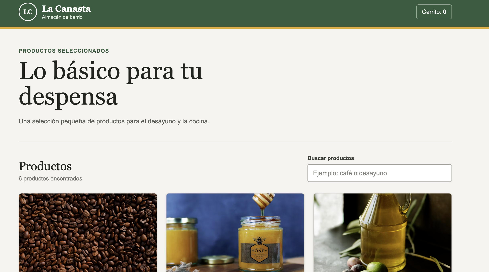
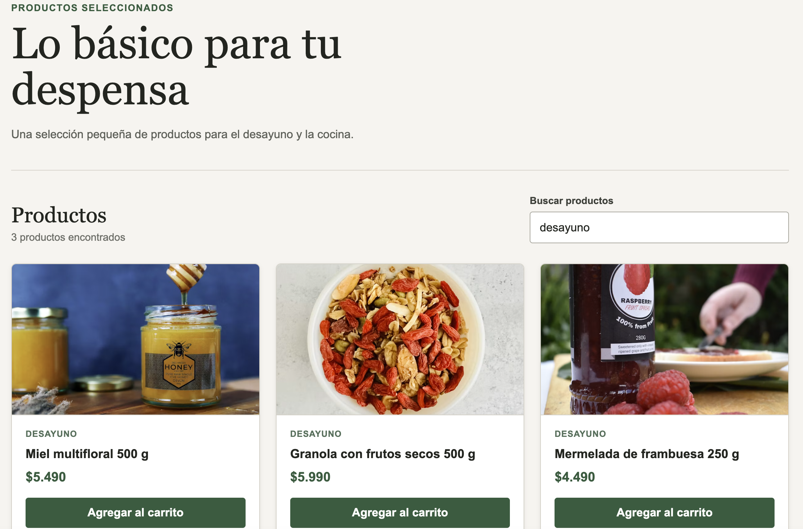

# La Canasta

E-commerce simple de productos de despensa. El proyecto fue desarrollado como ejercicio de componentes custom en React, utilizando datos simulados y sin conexión a un backend.

## Funcionalidades

- Listado de productos generado con `map` y una `key` única.
- Búsqueda por nombre o categoría.
- Contador básico de productos agregados al carrito.
- Mensaje cuando una búsqueda no tiene resultados.
- Diseño adaptable a escritorio, tablet y teléfono.

## Componentes creados

- `Header`: muestra el logo, el nombre de la tienda y el contador del carrito.
- `SearchBar`: input controlado para buscar productos.
- `ProductCard`: recibe cada producto mediante props y muestra su información.
- `ProductList`: recorre el array de productos y renderiza las tarjetas.
- `Button`: botón reutilizable con variantes `primary` y `secondary`.
- `Footer`: contiene la información básica del proyecto.

Los datos simulados se encuentran en `src/data/products.ts`. El estado se maneja con `useState` en `App` y `ProductCard`.

## Tecnologías usadas

- React
- TypeScript
- Vite
- CSS

## Cómo ejecutar el proyecto

1. Clonar el repositorio:

   ```bash
   git clone https://github.com/eduardrilo/la-canasta-react.git
   ```

2. Entrar a la carpeta del proyecto:

   ```bash
   cd la-canasta-react
   ```

3. Instalar las dependencias:

   ```bash
   npm install
   ```

4. Iniciar el servidor de desarrollo:

   ```bash
   npm run dev
   ```

5. Abrir en el navegador la dirección que muestra la terminal, normalmente `http://localhost:5173`.

## Capturas de pantalla

### Vista general



### Búsqueda de productos



## Datos de las imágenes

Las fotografías de los productos se cargan desde [Unsplash](https://unsplash.com/).
