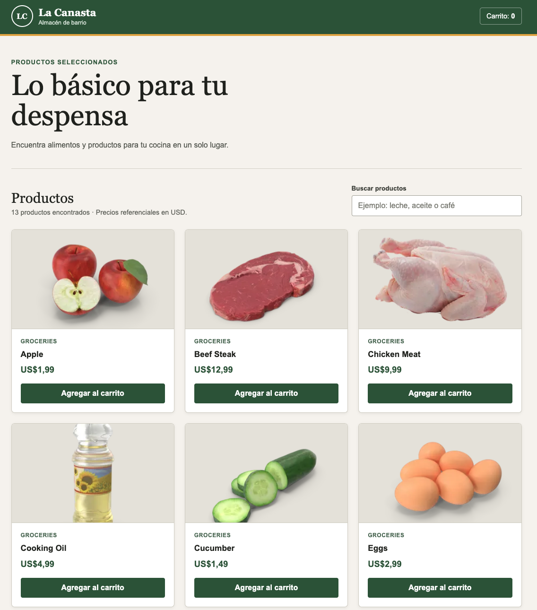
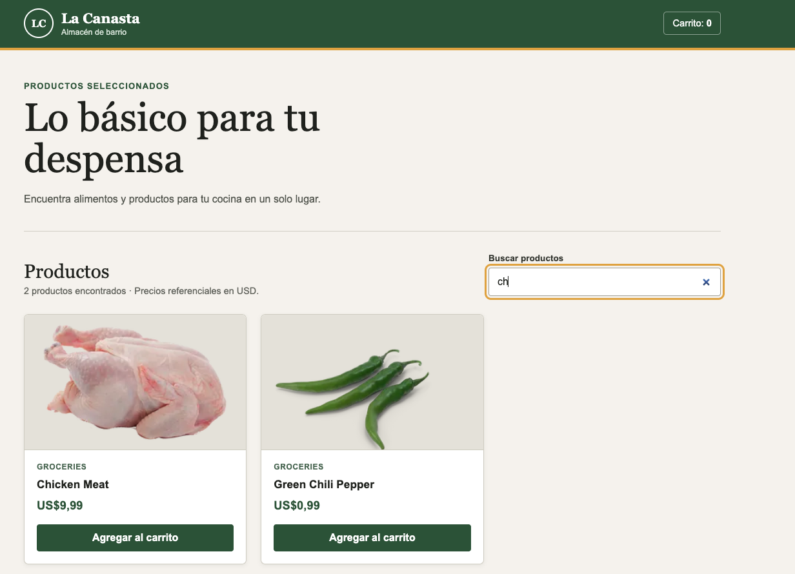

# La Canasta

E-commerce desarrollado en React y TypeScript que obtiene sus productos desde la API pública de DummyJSON.

## Funcionalidades

- Listado de productos obtenido desde `https://dummyjson.com/products`.
- Búsqueda por nombre o categoría.
- Estado de carga mientras se consulta la API.
- Mensaje de error con opción para volver a intentar.
- Contador básico de productos agregados al carrito.
- Mensaje cuando una búsqueda no tiene resultados.
- Diseño adaptable a escritorio, tablet y teléfono.

## Componentes creados

- `Header`: muestra el logo, el nombre de la tienda y el contador del carrito.
- `SearchBar`: input controlado para buscar productos.
- `ProductCard`: recibe cada producto mediante props y muestra su información.
- `ProductList`: recorre el array de productos y renderiza las tarjetas.
- `Loader`: muestra el estado de carga mientras se consulta la API.
- `ErrorMessage`: muestra un error si falla la consulta y permite reintentar.
- `Button`: botón reutilizable con variantes `primary` y `secondary`.
- `Footer`: contiene la información básica del proyecto.

El consumo de la API se realiza con `fetch` dentro de `useEffect`. La aplicación maneja los estados `products`, `loading` y `error`.

## Tecnologías usadas

- React
- TypeScript
- Vite
- CSS
- DummyJSON API

## Cómo ejecutar el proyecto

1. Clonar el repositorio:

   ```bash
   git clone https://github.com/eduardrilo/la-canasta-react.git
   ```

2. Entrar a la carpeta del proyecto:

   ```bash
   cd la-canasta-react
   ```

3. Instalar las dependencias:

   ```bash
   npm install
   ```

4. Iniciar el servidor de desarrollo:

   ```bash
   npm run dev
   ```

5. Abrir en el navegador la dirección que muestra la terminal, normalmente `http://localhost:5173`.

## Capturas de pantalla

### Vista general



### Búsqueda de productos



